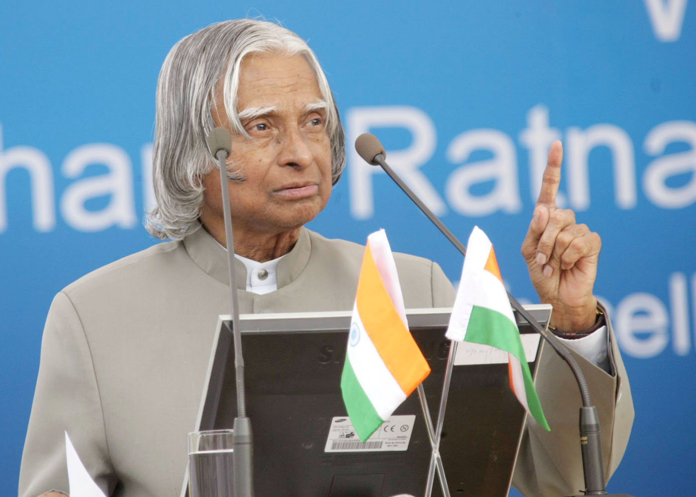
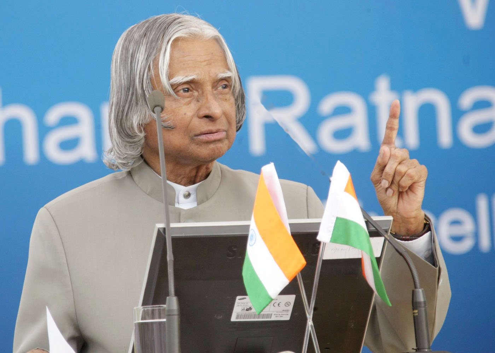
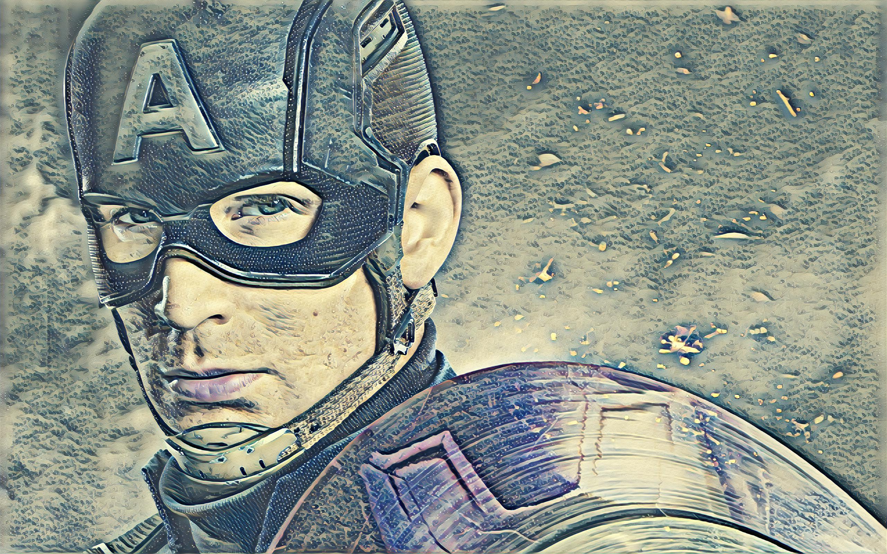
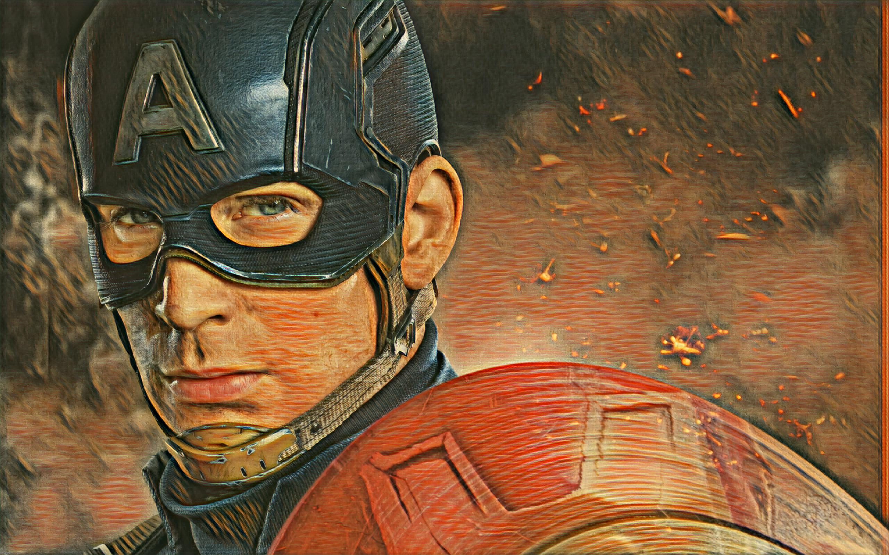

# image-restore-and-style-transfer
Fast style transfer in tensorflow and some restoration techniques which uses pillow and OpenCV

<b>NOTE : This works only with Python2 </b>

# Installation
Step 1 : Create a new folder and cd into that.  
Step 2 : Create a new virtual environment by running `virtualenv -p python2 <your_env_name>` 
Step 3 : Activate the new environment by running `source <your_env_name>/bin/activate` 
Step 4 : Clone this repository into that environment
Step 5 : run `pip install -r requirements.txt'

# Usage

To try the (basic) image restoration, cd into the image_restore folder  
**Only three modes are available (denoise, unsharp and inpaint)** 
Run `python restore.py --input <path_to_the_input_image> --output <path_to_save_the_output_image> --mode` 
if image inpainting has to be performed then an additional `--mask <path_to_the_mask_image` has to be provided for the mask image .

To try the image style transfer, cd into the style_transfer folder  
run `python evaluate.py --checkpoint <path_to_the_saved_models> --in-path <path_to_input_image> --out-path <path to output image>`
### the saved models are present in the checkpoint folder.

# Results

### Inpainting

 

### Style Transfer

 

 

